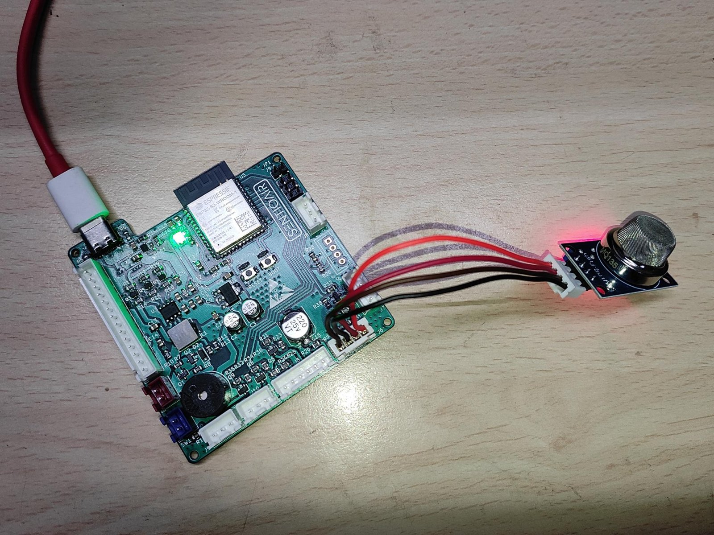

# 1. Hardware



*The setup used for this tutorial. The board is a custom one with the divider resistors and a buzzer on it; the
wiring below reproduces the same circuit on any ESP32-S3 board.*

## What you need

- An **ESP32-S3 board with its native USB port** available. The tutorial was written on an ESP32-S3-WROOM-1
  **N16R8** module (16 MB flash, 8 MB octal PSRAM); other ESP32-S3 modules work with the two changes listed in
  chapter 2.
- An **MQ-135 gas sensor module** (the common blue breakout with VCC, GND, AO and DO pins).
- **Two resistors** for a voltage divider: 4.7 kΩ and 6.8 kΩ, or any pair with a similar ratio.
- Optional: a **passive buzzer** driven through a transistor.
- For the stimuli: hand sanitizer or isopropyl alcohol with cotton swabs, and incense or matches.

## Wiring

```
MQ-135 module                         ESP32-S3
  VCC  ────────────────────────────── 5V (VBUS)      the heater draws about 150 mA: not the 3V3 pin
  GND  ────────────────────────────── GND
  AO   ──── 4.7k ────┬─────────────── GPIO6          any ADC1 pin: GPIO1 to GPIO10
                     6.8k
                     │
                    GND
  DO   (not connected)

Buzzer (optional)
  GPIO38 ── 1k ── base of an NPN transistor; emitter to GND; buzzer between 5V and the collector
```

Do not connect AO straight to the pin. It can approach 5 V, and the ESP32-S3 tolerates 3.3 V.

Every pin and resistor value above lives in one file,
[board_config.h](../firmware/components/board/include/board_config.h). If your wiring differs, edit it there and
nowhere else:

| Setting | Default | Meaning |
|---|---|---|
| `BOARD_MQ135_ADC_CHANNEL` | `ADC_CHANNEL_5` | GPIO6. On the ESP32-S3, GPIO1 to GPIO10 are ADC1 channels 0 to 9 |
| `BOARD_DIVIDER_TOP_OHM` | 4700 | resistor between AO and the pin |
| `BOARD_DIVIDER_BOTTOM_OHM` | 6800 | resistor between the pin and GND |
| `BOARD_MQ135_RL_OHM` | 2000 | load resistor on the module, see below |
| `BOARD_BUZZER_GPIO` | 38 | set to `-1` if there is no buzzer |

Avoid GPIO26 to GPIO37 on modules with octal flash or PSRAM, which use them, and use ADC1 pins only.

## How the MQ-135 produces a voltage

The sensor is a tin-dioxide element kept hot by a 5 V heater. Its resistance **Rs** drops when reducing gases
(alcohol, ammonia, smoke, solvents) reach the surface. On the module, Rs and a fixed load resistor **RL** form a
voltage divider across 5 V, and AO is the voltage across RL:

```
5V ── Rs ──┬── AO
           RL
           │
          GND          AO = 5 V × RL / (Rs + RL)
```

More gas means lower Rs and a higher AO.

## Why the board has its own divider

AO can approach 5 V, and an ESP32-S3 ADC pin measures up to about 3.1 V (at 12 dB attenuation). The board scales
AO down with 4.7k on top and 6.8k below:

```
V_pin    = AO × 6.8 / (4.7 + 6.8)     so 5 V becomes 2.96 V
AO       = V_pin × 115 / 68           the firmware calls this the "true" voltage
```

That divider (11.5k in total) also sits in parallel with the module's load resistor, so the load the sensor
actually sees is smaller than the resistor printed on the module:

```
RL_eff = RL ∥ 11.5k        a stock 2k module gives 2k ∥ 11.5k ≈ 1.70 kΩ
Rs     = RL_eff × (5 V − AO) / AO
```

Check the load resistor on your module (the SMD part near the AO pin: `202` is 2k, `102` is 1k) and put its value
in `BOARD_MQ135_RL_OHM`. It only affects the Rs figure the logger prints; the model never uses it.

## What to expect from an unmodified module

With a small load resistor the clean-air signal is low. The sensor used for this tutorial measured about **184 mV at AO,
109 mV at the pin** in room air, which puts Rs near 45 kΩ. Your sensor will differ, and chapter 3 measures it.

Two consequences for the rest of the tutorial:

- The firmware averages 64 ADC reads per sample, which resolves the small clean-air signal well below the ADC's
  1 mV steps.
- The model never sees absolute voltage. Each window is divided by a clean-air baseline, so a low signal level
  costs resolution but not correctness.

## Burn-in and warm-up

- **Once:** leave a new sensor powered for 24-48 hours. The reading drifts down for many hours before it settles.
- **Every session:** power the board for at least 5 minutes before recording or testing.

Data recorded on a cold sensor teaches the model the warm-up curve instead of the gases.

## Check

The board is plugged in over its native USB port, appears as a serial device (`/dev/ttyACM0` on Linux), and has
been powered long enough to finish burn-in. The voltage check comes in chapter 3, where the firmware prints it.
